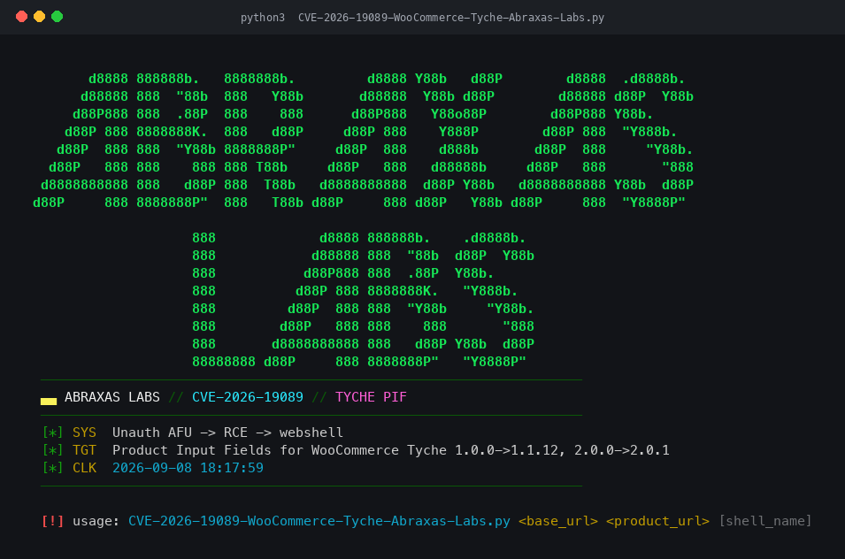

# CVE-2026-19089 — WooCommerce Tyche (Product Input Fields)

**Status: incomplete / work in progress.** This repository is a stub. The script is not a finished PoC, is not packaged for use, and should not be treated as a complete or reliable demonstration.

Abraxas Labs research notes for CVE-2026-19089 (also referenced alongside CVE-2024-13359) affecting the WooCommerce **Product Input Fields** plugin by Tyche Softwares.

## What’s here

| File | Notes |
| --- | --- |
| `CVE-2026-19089-WooCommerce-Tyche-Abraxas-Labs.py` | Draft research script. Incomplete. Not ready. |

Expected later (not in this commit):

- Accurate version / patch mapping
- A complete, documented write-up
- Clean reproduction notes for authorized lab environments only

## Disclaimer

Research and educational material only. Do not run this against any host without explicit written permission from the system owner.

- Website: https://abraxaslabs.tech
- GitHub: https://github.com/abraxas
- Twitter: [@abraxas_null](https://twitter.com/abraxas_null)
